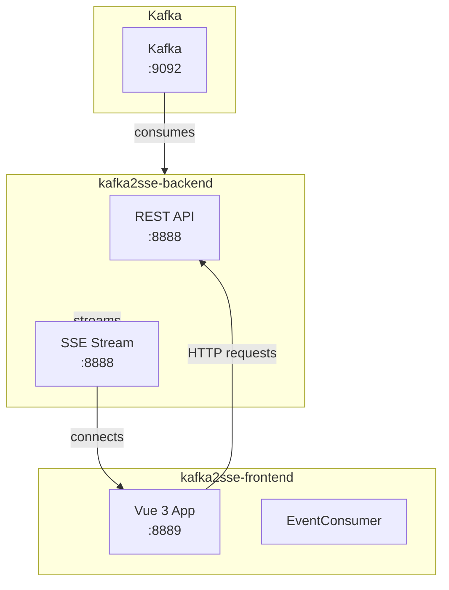

# kafka2sse-frontend

A real-time Vue 3 dashboard that consumes Server-Sent Events (SSE) from kafka2sse-backend and displays streaming Kafka events.

## Description

A sleek frontend dashboard that connects to the kafka2sse-backend SSE endpoint and visualizes incoming Kafka events in real-time. Perfect for monitoring Kafka streams without polling.

## Architecture



## Features

- **Real-time streaming**: Events appear instantly as they arrive from Kafka
- **Auto-reconnect**: Automatically reconnects if the SSE connection drops
- **Event counter**: Live count of received events
- **Clean Vue 3 + Vite setup**: Fast, modern, minimal dependencies

## Quick Start

### Prerequisites

- Node.js 22+
- [kafka2sse-backend](https://github.com/entitybase-orchestrator/kafka2sse-backend) running on port 8888

### Development

```bash
npm install
npm run dev
```

Open http://localhost:5173 in your browser.

### Production Build

```bash
npm run build
```

### Run with Docker

```bash
make run
```

The frontend will be available at http://localhost:8889

## Environment

The frontend connects to the backend at `http://localhost:8888` by default. Update the SSE endpoint URL in the component as needed.

## API Integration

The frontend connects to these backend endpoints:

- `GET /v1/streams/{topic}` - SSE stream for a Kafka topic
- `GET /v1/topics` - List available Kafka topics
- `GET /health` - Health check

## Commands

| Command | Description |
|---------|-------------|
| `npm run dev` | Start development server |
| `npm run build` | Build for production |
| `npm run lint` | Run ESLint |
| `npm run test` | Run tests (watch mode) |
| `npm run test:run` | Run tests once |
| `make run` | Build and run Docker container |
| `make stop` | Stop container |
| `make clean` | Clean up containers and build cache |
